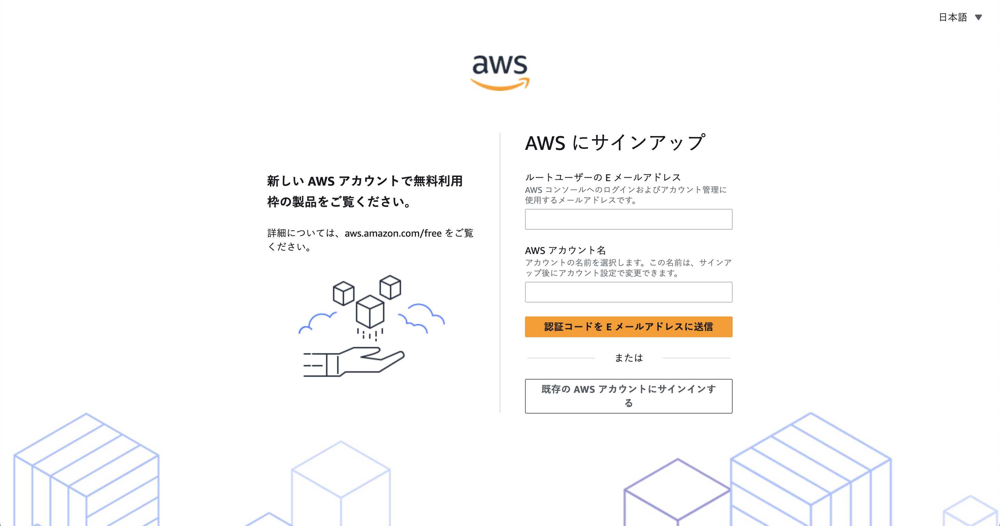
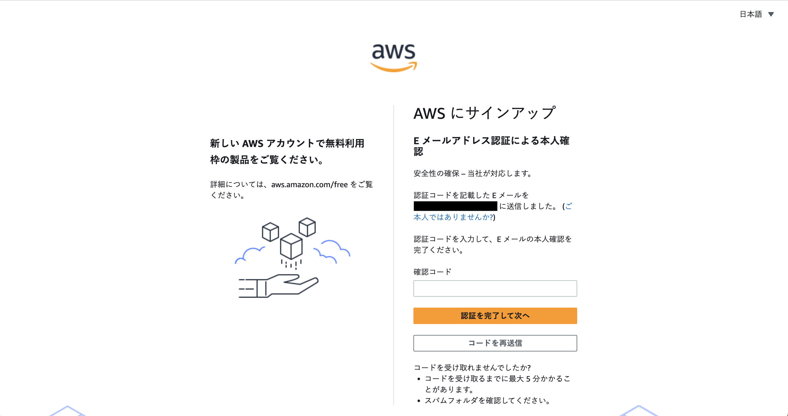
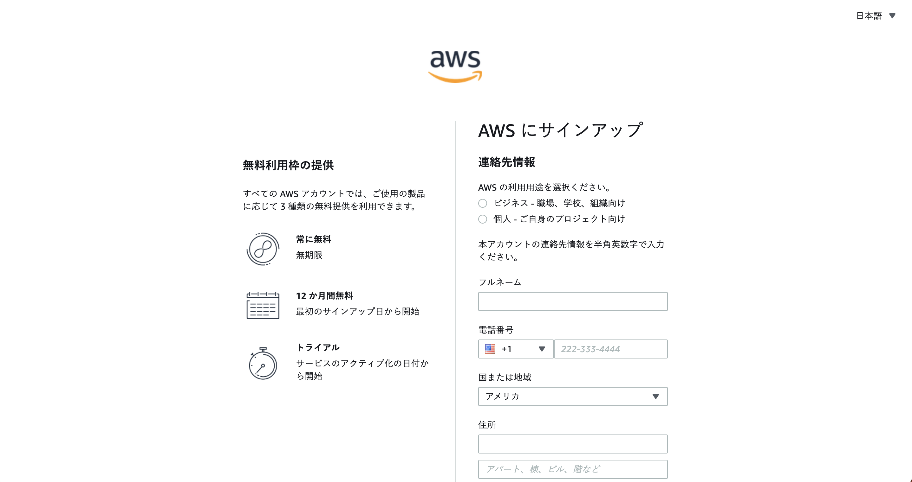
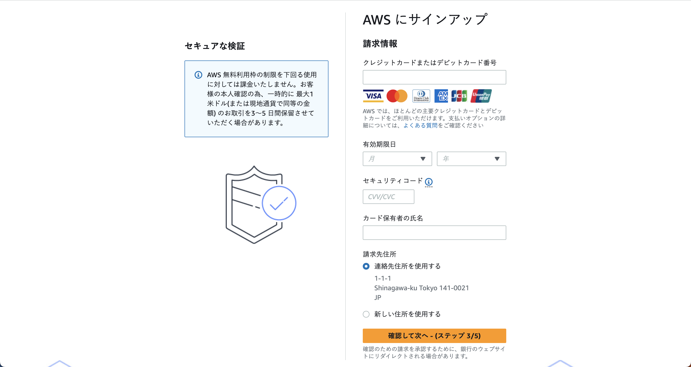
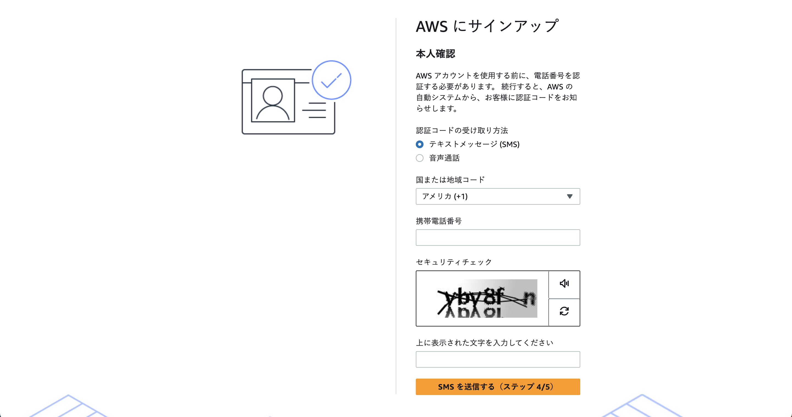
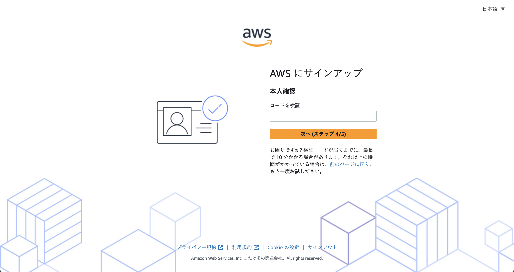
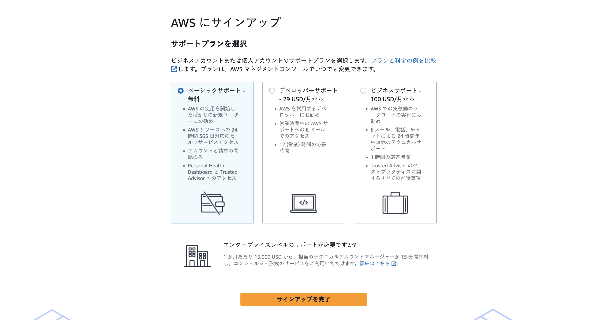

# Herokuデプロイ手順

ここではローカル環境で動作させているpotepanecアプリケーションをHerokuにデプロイする手順を説明します。

# ゴール

- ローカルと同じ動作がHeroku上でも実現できていること
- ユニークなURLが生成され、誰でもアクセス出来る状態になっていること

# 準備

## Herokuアカウントの作成

最終課題に入るタイミングで、Herokuより招待メールが送信されています。

Herokuアカウントを既にお持ちか否かで設定手順が異なってきますので、ご注意ください。

### Herokuアカウントをお持ちの場合

`Invitation to collaborate on (アプリケーション名)`という件名の招待メールが送信されています。

その中の`visit the app in the dashboard`というリンクをクリックいただくと、Herokuのサイトへ遷移します。

遷移後、ご自身のGithubアカウントと同じ名前（※「大文字→小文字」、「アンダースコア→ハイフン」の形式で変換されています）のAppが表示されていれば、Herokuの事前準備は完了ですので、次のステップへ進んでいきましょう。

### Herokuアカウントをお持ちでない場合

`You've been invited to collaborate on a Heroku app`という件名の招待メールが送信されています。

このメールの中に `Accept Invitation`というボタンがありますので、そちらをクリックしてください。

その後、以下のようなアカウント作成ページ或いはパスワード設定ページへ遷移しますので、必要事項を記入してください。


設定完了後、フォーム下部のボタンをクリックすると以下の利用規約ページへ遷移しますので、設定は変更せずそのまま`Accept`ボタンをクリックしてください。


ダッシュボードページ左上の`Personal`という部分をクリックいただくと、ダイアログの下部に`final-task`というメニューが表示されますので、そちらをクリックしてください。


遷移後、ご自身のGithubアカウントと同じ名前（※「大文字→小文字」、「アンダースコア→ハイフン」の形式で変換されています）のAppが表示されていれば、Herokuの事前準備は完了ですので、次のステップへ進んでいきましょう。

## Heroku CLIをインストール

HerokuへのデプロイにはHeroku CLIを利用します。[インストール](https://devcenter.heroku.com/articles/heroku-cli#download-and-install)しておきましょう。

## AWS S3との連携

開発環境ではローカルにそのまま画像が保存されていましたが、Herokuではクラウドファイルストレージサービスの利用が推奨されています。

ここでは[AWS S3](https://aws.amazon.com/jp/s3/)を使用するので、さっそく連携する設定を行いましょう。

AWS S3はクラウド上のストレージにファイルを保存、ダウンロードすることができるサービスです。多くの画像を扱うライブラリはこれに対応しておりますが、今回はRails標準の`Active Storage`を使用します。

ここではAWSの無料枠を使ってS3とアプリケーションを連携し、商品画像を保存した時にS3にそのファイルが保存されるようにします。また、商品ページにアクセスした時にS3から画像をダウンロードし、ブラウザに表示されるようにします。

### AWSアカウントの作成

まずはAWSのアカウントを作成しましょう。以下のURLから下記の手順に従って情報を入力してください。
https://portal.aws.amazon.com/billing/signup

1. アカウント情報を登録する
2. プロフィール情報を登録する
3. お支払い情報を登録する（※1）
4. アカウントを認証する
5. プランを選択する

※1. AWSにはいくつかのサービスで[無料枠](https://aws.amazon.com/jp/free/?all-free-tier.sort-by=item.additionalFields.SortRank&all-free-tier.sort-order=asc)があり、S3では5GBまで無料で使えます。途中、クレジットカード情報を入力する場面がありますが、無料枠内であれば実際に請求されることはございませんのでご安心ください。

#### 手順1. アカウント情報を登録する

1. 表示されたページが「日本語」でない場合、ページ右上の言語選択ボックスより「日本語」を選択後、サインアップ画面へお進みください。
2. 「ルートユーザーのEメールアドレス」には、AWSへのログイン時に使用するメールアドレスを設定してください。
3. 「AWS アカウント名」に、ご自身のお名前を半角アルファベットで入力してください。
4. 問題なければ、「認証コードをEメールアドレスに送信」ボタンをクリックしてください。



5. 「ルートユーザーのEメールアドレス」で入力したメールアドレスに確認コードが届きます。そちらを入力し、「認証を完了して次へ」ボタンをクリックしてください。



6. 「root ユーザーパスワード」にAWSへのログイン時に使用するパスワードを設定し、確認用にもう一度同じパスワードを入力してください。入力が完了したら、「続行」ボタンをクリックしてください。


#### 手順2. プロフィール情報を登録する

1. 「AWS の利用用途を選択ください。」の項目は「個人 - ご自身のプロジェクト向け」を選択してください。
2. 以降の連絡先情報は、すべて「**半角アルファベットおよび半角数字**」で入力してください（※以下の記載例をご覧ください）。

- フルネーム（必須）: フルネームを入力してください。
- 会社名: 会社名を入力してください。
- 電話番号： プルダウンメニューからお住まいの国を選択してください。続けて、**ご自身のお電話番号の先頭のゼロを削除し、ハイフン・記号なし**で入力してください。(例：312345678)
- 国または地域コード: 国を選択してください。
- 住所： ご自身の住所の番地、建物名等を入力してください。(例 : 1-1-1, Kamiosaki ABC Building)
- 市区町村： ご自身の住所の市区町村名を入力してください。(例 : Shinagawa-ku)
- 州/都道府県または地域: 自身のご住所の都道府県名を入力してください。(例 : Tokyo)
- 郵便番号: 住所の郵便番号をハイフン付きで入力してください。(例：141-0021)

3. 「AWS カスタマーアグリーメント」にチェックの上、「続行」ボタンをクリックしてください。



#### 手順3. お支払い情報を登録する

次に請求情報（お支払い情報）の登録を行います。

※アカウントでAWS無料利用枠の制限を超えた場合にAWSのサービスの有料使用にシームレスに移行できるようにするため、クレジットカードまたはデビットカードが必要になります。無料枠内であれば実際に請求されることはございませんのでご安心ください。

1. 有効なクレジットカードまたはデビットカード情報を入力してください。AWSでは、ほとんどの主要クレジットカードとデビットカードをご利用いただけます。カード番号、有効期限などの情報に間違いのないようお気をつけください。
2. 請求先住所を選択します。前のステップでご入力いただいたご住所と同様の場合は、「連絡先住所を使用する」を選択してください。アカウント作成時にご入力いただいたご住所と異なる請求先となる場合は、「新しい住所を使用する」を選択して、請求先住所を入力してください。入力が完了したら、「確認して次へ」ボタンをクリックしてください。



#### 手順4. アカウントを認証する

続いて、作成していただいたAWSアカウントのご本人確認を行います。

1. 検証方法を「テキストメッセージ（SMS）」または「音声通話」からお選びください。
2. 「国または地域コード」で国を選択し、続けて、**ご自身のお電話番号の先頭のゼロを削除し、ハイフン・記号なし**で入力してください。(例：312345678)
3. 「セキュリティチェック」に表示された英数字を入力してください。入力が完了すれば、「SMSを送信する」ボタンをクリックしてください。

※アカウント認証に際しては、以下の点にご注意ください。

- 携帯電話等で非通知の着信拒否設定を行っている場合は、着信拒否設定の解除が必要です。オレンジのボタンをクリックする前に、必ず電話がかかる状態にしておいてください。
- SMSの場合「SMSを送信する」、音声通話の場合「今すぐ呼び出し」ボタンをクリックすると、即座に音声電話またはSMSが届きます。すぐに着信を受け取れる電話番号を入力してください。
- 国番号選択を誤ると電話がかかってきませんので、必ず正しい国コードをご選択ください。



4. 検証コードが届いたら、入力欄に検証コードを入力し、「次へ」ボタンをクリックしてください。



#### 手順5. プランを選択する

最後に、AWSのサポートプランとして「ベーシックサポート」を選択してください。選択が完了したら、「サインアップを完了」ボタンをクリックしてください。



以上の手続きでサインアップ (AWSアカウントの作成) は完了です。お疲れ様でした！

### IAMユーザーの作成

アカウントが作成できれば、次は[IAM](https://console.aws.amazon.com/iam/home?region=ap-northeast-1#/home)ユーザーを作成します
IAMはAWSサービスの1つで、簡単に言うと先ほど作成したAWSアカウントに紐づくユーザー情報を作成・編集・削除出来るものです。IAMユーザーには各AWSサービスに対する権限、例えば「S3に画像をアップロードする権限」を設定できます。

ここではSolidusアプリケーションに設定するためのユーザー、`potepanec`ユーザーを作成し、必要な権限を付与していきましょう。

まずは[AWS IAM](https://console.aws.amazon.com/iam/home?region=ap-northeast-1#/home)のページにアクセスします。

左のメニューから`Users`->`Add users`を選択し、以下の手順でユーザーの作成を進めてください。

1. `User name`に`potepanec`を入力し、次へ進む（※`Enable console access`のチェックは不要です。）
2. `Permissions options`で`Attach policies directly`を選択する
3. `Permissions policies`から`AmazonS3FullAccess`を選択し、次へ進む
4. `Tags`には何も入れず、`Create user`をクリックする

無事ユーザーが作成されましたので、続いて、以下の手順でアクセス情報を生成していきます。

1. ユーザー一覧より、`potepanec`をクリックする
2. `Security credentials`のタブをクリックする
3. ページ中段の`Access keys`セクションの`create access key`をクリックする
4. `Access key best practices & alternatives`で`Other`を選択し、次へ進む
5. `Description tag`には何も入れず、`Create access key`をクリックする
6. `Download .csv file`をクリックし、アクセス情報をダウンロードする

このファイルは後にpotepanecアプリケーションとAWSを連携させる際に必要になるため、どこかに保存しておいてください。
（※秘匿情報ですので、他人には公開しないでください。）

### S3バケットの作成

バケット(bucket)とはS3上のフォルダのようなもので、ファイルを保存したり、さらにその下にフォルダを作成することができます。

AWS CLIを使ってバケットを作成するので、まずはAWS CLIをインストールしましょう。

```sh
$ brew install awscli
```

インストールが完了したことが確認できれば、先ほどダウンロードした`potepanec`ユーザーの情報が記載されたCSVファイルを参照しながら、AWS CLIの設定を行いましょう。

```sh
$ aws configure
AWS Access Key ID [None]: （potepanecユーザーのAccess key ID）
AWS Secret Access Key [None]: （potepanecユーザーのSecret access key）
Default region name [None]: ap-northeast-1
Default output format [None]: json
```

設定できればAWS CLIを使ってバケットを作成します。

※バケット名はS3上でユニークでなければならないため、バケット名「potepanec」の部分は適宜変更してください。

```sh
$ aws s3 mb s3://potepanec
make_bucket: potepanec
$ aws s3api put-public-access-block --bucket potepanec --public-access-block-configuration "BlockPublicAcls=false,IgnorePublicAcls=false,BlockPublicPolicy=false,RestrictPublicBuckets=false"
$ aws s3api put-bucket-ownership-controls --bucket potepanec --ownership-controls Rules=[{ObjectOwnership=ObjectWriter}]
$ aws s3api put-bucket-acl --bucket potepanec --acl public-read
$ aws s3 ls
YYYY-MM-DD HH:MM:SS potepanec
```

最後のコマンドでバケットの名前が表示されれば設定は完了です。

#### ＜コマンドが実行できない場合＞

シェルをzshに設定している場合、3つ目のコマンド（`aws s3api put-bucket-ownership-controls ... Rules=[{ObjectOwnership=ObjectWriter}]`）を実行した際に`zsh: no matches found`というエラーが出力されることがあります。

この場合は、`Rules=`以降のコマンドをダブルクォーテーションで括っていただいた上で再度実行してください。

```sh
$ aws s3api put-bucket-ownership-controls --bucket potepanec --ownership-controls Rules="[{ObjectOwnership=ObjectWriter}]"
```

### Active Storageの設定

最後にpotepanecアプリケーションとS3を連携させ、商品画像がS3に保存されるようにしましょう。

Active Storageの基本設定は済んでいるので、AWSのアカウント情報、およびS3のバケット情報をActive Storageに伝える設定を行います。

[Active Storageのガイド](https://railsguides.jp/active_storage_overview.html)を参考にして`config/storage.yml`のamazonの項目のコメントアウトを外して必要な変更を加えましょう。

```yml
amazon:
  service: S3
  access_key_id: <%= ENV['AWS_ACCESS_KEY_ID'] %>
  secret_access_key: <%= ENV['AWS_SECRET_ACCESS_KEY'] %>
  region: ap-northeast-1
  bucket: バケット名
```

※「bucket: バケット名」の部分は一つ前の手順でAWS S3に作成したバケット名を設定してください。

最後に、この変更をコミットしましょう。

```sh
$ git commit -a -m "Configure Active Storage to use S3"
```

ここでは`AWS_ACCESS_KEY_ID`と`AWS_SECRET_ACCESS_KEY`という環境変数から、IAMユーザーの認証情報を取得するようにしています。環境変数を使っているのはセキュリティ上の懸念からです。認証情報をそのままコード内に記述してGitHubなどの不特定多数のユーザーがアクセスできる環境に公開されてしまうと、それを悪用される可能性があります。注意しましょう。

# 初めてのデプロイ

## HerokuへDeploy

それでは、Herokuにデプロイするまでの手順を一通り行ってみましょう。

まずは各自にご用意しているHerokuアプリケーションの情報を確認します。

Herokuからの招待メールに記載されているアプリケーション名を確認の上、以下を実行しましょう。

```sh
$ heroku info -a (アプリケーション名)
```

次にアプリケーション情報の中からHerokuアプリケーション用の`Git URL`を確認し、push先のリポジトリとして登録しましょう。

```sh
$ git remote add heroku (Git URL)
```

次に、事前に準備したAWS S3バケットへの接続情報を`potepanec`アプリケーションが取得できるように、heroku CLIを使って設定します。

```sh
$ heroku config:set AWS_ACCESS_KEY_ID=(potepanecユーザーのAccess key ID) AWS_SECRET_ACCESS_KEY=(potepanecユーザーのSecret access key) -a (アプリケーション名)
```

最後にHeroku上にコードをデプロイします。
ここではデプロイしたいブランチ名を`testbranch`と仮定します。

```sh
$ git push heroku testbranch:master
```

デプロイが無事完了すると以下のようなメッセージが表示されます。

```
https://(アプリケーション名).herokuapp.com/ deployed to Heroku
```

URLはHerokuによって自動的に生成されます。このURLがあなたのアプリケーションのURLとなります。
試しにブラウザでアクセスしてみましょう。

以下のような画面が表示されていればデプロイは完了ですので、「データベースの作成」セクションまで進んでください。


## データベースの作成

Railsでは[環境毎に異なる設定を持たせることが可能](https://railsguides.jp/configuring.html#rails%E7%92%B0%E5%A2%83%E3%82%92%E4%BD%9C%E6%88%90%E3%81%99%E3%82%8B)です。これを利用してHeroku上での環境である`production`環境でデータベースに接続できるようにしましょう。

まずは接続するデータベースを作成していきます。

Herokuには[JawsDB](https://elements.heroku.com/addons/jawsdb)というMySQLデータベースを作成するためのプラグインが存在するため、これを利用します。ターミナルで以下のコマンドを実行してください。

```sh
$ heroku addons:create jawsdb:kitefin
```

次にRailsに作成したデータベースの接続情報を追加していきます。
`config/database.yml`にある`production`の設定情報を以下のように変更してください。

```diff
 production:
   <<: *default
-  database: potepanec_2_7_production
-  username: potepanec
-  password: <%= ENV['POTEPANEC_DATABASE_PASSWORD'] %>
+  url: <%= ENV['JAWSDB_URL']&.sub('mysql://', 'mysql2://') %>
```

`JAWSDB_URL`は先程設定したJawsDBプラグインから提供される環境変数で、ユーザー名やパスワードを含めデータベースに接続するためのすべての情報が格納されています。

以上でデータベースの設定は完了です。

変更をcommitして、再度Herokuにデプロイしましょう。

```sh
$ git commit -a -m "Look for env var defined by JAWSDB addon on production"
$ git push heroku testbranch:master
```

デプロイが完了したら、もう一度URLにアクセスしてみましょう。

変わらず以下のような画面が表示されていると思います。こちらで特に問題はありませんので、「データベースの設定」セクションまで進んでください。


## データベースの設定

ここでは、Solidusが必要とするテーブル、および初期データを作成していきましょう。

まずはテーブルの作成です。ターミナルで以下のコマンドを実行してください（※以降のコマンドも同様にターミナルで実行してください）。

```sh
$ heroku run bin/rails db:migrate
```

`heroku run`は与えられた任意のコマンドをHeroku上で実行するコマンドです。
ここでは `bin/rails db:migrate`を実行し、必要なテーブルを作成しています。

また、下記のコマンドも実行して`Sample Store`のテーブルを作っておきましょう。

```sh
$ heroku run bin/rails runner 'Spree::Store.create!(name: "Sample Store", code: "sample-store", url: "example.com", mail_from_address: "store@example.com")'
```

これで必要なテーブルは作成できたはずです。続いて、Solidusが用意しているサンプルデータをテーブルに格納していきましょう。

以下のコマンドを実行してください。

```sh
$ heroku run bin/rails runner "['products', 'taxons', 'option_values', 'product_option_types', 'product_properties', 'variants', 'assets'].each { |table| Spree::Sample.load_sample(table) }"
```

コマンドの実行が完了したら、アプリケーションのURLにアクセスしてみましょう。

変わらず以下のような画面が表示されていると思います。こちらでHeroku上での設定は完了です。お疲れ様でした！


### 補足

通常であれば `heroku run bin/rails g spree:install`を実行することでサンプルデータも同時に作成されます。しかし、これを実行した時にデータベースに発行されるクエリの回数がJawsDBの無料プランの上限を超えてしまいエラーになってしまいます。

ここでは代わりに必要なサンプルデータだけを作成するコマンドを実行することで、無料プランによる制限に引っかかるのを回避しています。
